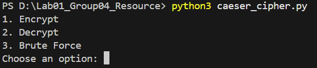
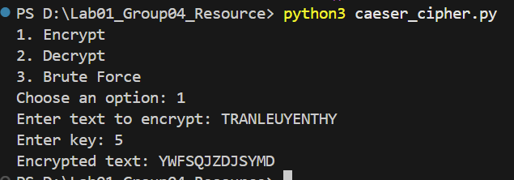

# NT101.Q21-LAB1

## MỤC TIÊU
Mục tiêu của bài thực hành này là tìm hiểu nguyên lý hoạt động, cách triển khai và phương pháp tấn công đối với các hệ mật mã cổ điển phổ biến

## NỘI DUNG
Báo cáo bao gồm việc xây dựng chương trình mã hóa/giải mã và thực hiện các nhiệm vụ phân tích cho 5 loại mật mã sau:
- Mật mã Caesar: Triển khai hàm mã hóa $C=(p+k) \pmod{26}$ và giải mã bằng phương pháp Brute-force để tìm bản rõ khi chỉ biết ciphertext.
- Mật mã Thay thế đơn mẫu (Mono-alphabetic Substitution):Sử dụng Phân tích tần suất (Frequency Analysis) thủ công dựa trên đặc điểm ngôn ngữ tiếng Anh (tần suất ký tự đơn, bigrams, trigrams) để khôi phục bản rõ. Xây dựng thuật toán giải mã tự động kết hợp Hill Climbing và Random Restart để tối ưu hóa điểm số văn bản dựa trên cấu trúc ngôn ngữ.
- Mật mã Playfair: Triển khai ma trận $5 \times 5$, xử lý các cặp ký tự trùng lặp và thực hiện mã hóa/giải mã theo quy tắc hình chữ nhật, cùng hàng hoặc cùng cột.
- Mật mã Vigenère (Polyalphabetic Cipher):Mã hóa và giải mã dựa trên khóa có độ dài hữu hạn.Phá mã không cần khóa: Sử dụng Chỉ số trùng hợp (Index of Coincidence - IoC) để tìm độ dài khóa và phương pháp Chi-Square để xác định chính xác từng ký tự trong khóa.
- Mật mã Rail Fence: Thuật toán hoán vị sắp xếp ký tự theo đường zigzag với số hàng (key) xác định.

## CÔNG NGHỆ SỬ DỤNG
Ngôn ngữ: Python

## CÁCH CHẠY
- Clone repository:
   ```bash
   git clone [https://github.com/NT101-Q21/Lab01_Group04_Resource.git](https://github.com/NT101-Q21/Lab01_Group04_Resource.git)
   cd LAB01_GROUP04_RESOURCE
   ```

- Gõ lệnh python3 + tên file.py


- Chọn phần muốn thực hiện (mã hóa hoặc giải mã), nhập text và key tùy vào từng bài

